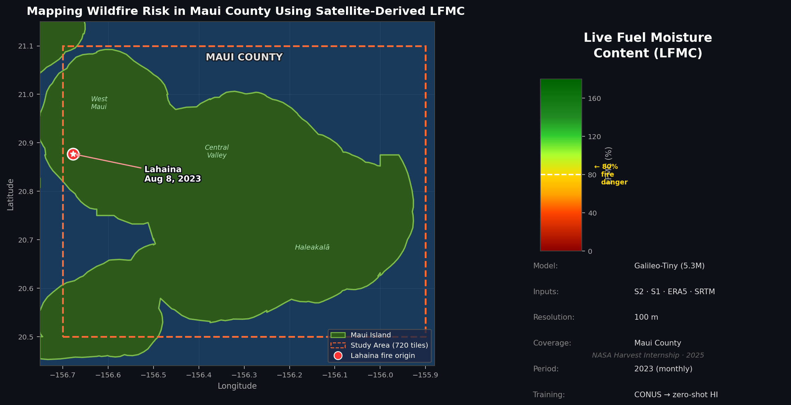
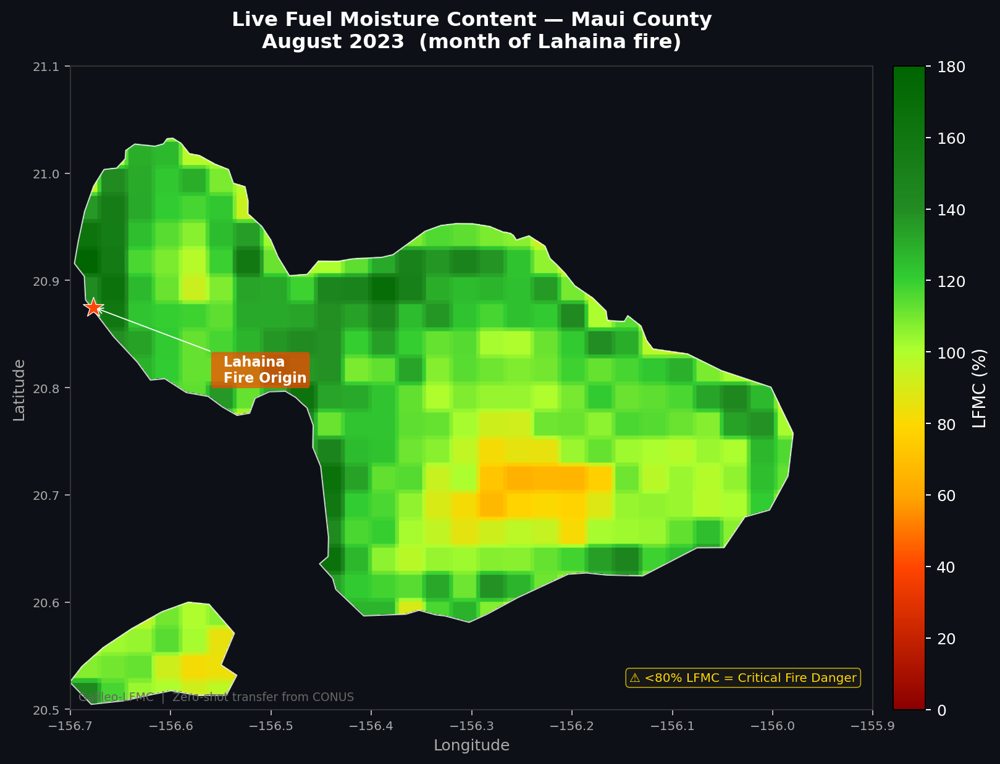

# Mapping Wildfire Risk in Maui County Using Live Fuel Moisture Content



## Project Overview

This project generates high-resolution monthly maps of Live Fuel Moisture Content (LFMC)
for Maui County, Hawaii. LFMC measures water content in living vegetation as a percentage —
below 80% indicates critical wildfire danger. The 2023 Lahaina fire, which killed 100+ people,
occurred when vegetation was critically dry.

We reproduce Johnson et al. (2025) by fine-tuning the Galileo-Tiny foundation model on
CONUS Globe-LFMC data, then apply the trained model **zero-shot to Maui** (the same
approach used for the 2025 LA Palisades/Eaton fire case studies in that paper). There are
no Hawaii samples in Globe-LFMC 2.0 — the contribution of this project is generating and
analyzing pre/post-Lahaina LFMC maps using Galileo's learned representations.

## Key References

| Resource | Link |
|----------|------|
| Johnson et al. (2025) paper | https://arxiv.org/abs/2506.20132 |
| Official AllenAI LFMC pipeline | https://github.com/allenai/lfmc |
| Galileo foundation model | https://github.com/nasaharvest/galileo |
| Galileo weights (HuggingFace) | https://huggingface.co/nasaharvest/galileo |
| Globe-LFMC 2.0 dataset | https://doi.org/10.1038/s41597-024-03159-6 |
| Globe-LFMC 2.0 data (figshare) | https://doi.org/10.6084/m9.figshare.24312164 |

## Architecture

### Model
- **Galileo-Tiny**: 5.3M parameter Vision Transformer pretrained on multimodal satellite data
- **Regression head**: Single linear layer mapping encoder embedding → LFMC %
- **Training**: Fine-tuned on Globe-LFMC 2.0 CONUS subset (41,214 samples, 1,031 sites)
- **Target performance**: RMSE ≈ 18.9, R² ≈ 0.72 (Johnson et al. 2025 Table 1)

### Data (all from Google Earth Engine)
Each sample = one 1km × 1km GeoTIFF with 12 monthly composites of:
- Sentinel-2 L1C (10 bands, optical/NDVI)
- Sentinel-1 (VV, VH SAR backscatter)
- ERA5-Land (temperature, precipitation, ET)
- TerraClimate (climate water balance)
- VIIRS (night lights)
- SRTM (elevation, slope)
- DynamicWorld + WorldCereal (land cover)
- LandScan (population, static)

### Inference
Maui County (20.5°–21.1°N, 156.7°–155.9°W) is tiled into overlapping 32×32 pixel patches
(320m × 320m at 10m resolution), processed by the CONUS-trained model, then stitched
into a wall-to-wall GeoTIFF via overlap averaging to remove edge artifacts.

## Repository Structure

```
maui-lfmc/
├── src/
│   ├── data/
│   │   └── download_tifs.py      # GEE satellite download (training + inference)
│   ├── model/
│   │   └── train.py              # Fine-tune Galileo on Globe-LFMC (wraps allenai/lfmc)
│   └── inference/
│       └── map_generator.py      # Generate monthly LFMC maps for Maui County
├── requirements.txt
└── README.md
```

## Setup

### 1. Install conda environment

```bash
conda create -n lfmc python=3.11
conda activate lfmc
conda install -c conda-forge gdal rasterio geopandas
pip install torch torchvision --index-url https://download.pytorch.org/whl/cu121
pip install -r requirements.txt
```

### 2. Clone and install Galileo + AllenAI LFMC

```bash
git clone --recurse-submodules https://github.com/allenai/lfmc.git allenai-lfmc
pip install -e allenai-lfmc/submodules/galileo
pip install -e allenai-lfmc
```

### 3. Authenticate Google Earth Engine

```bash
earthengine authenticate
```

### 4. Get Globe-LFMC 2.0 labels

Download `Globe-LFMC-2.0.xlsx` from https://doi.org/10.6084/m9.figshare.24312164,
then run:

```bash
cd allenai-lfmc
python -m lfmc.main.create_csv
```

This creates `data/labels/lfmc_data_conus.csv` (~90K CONUS samples).

## Usage

### Step 1: Download training data (overnight, ~90K TIFs)

```bash
# Small test batch first (recommended)
python -m src.data.download_tifs \
    --labels allenai-lfmc/data/labels/lfmc_data_conus.csv \
    --output data/tifs/ \
    --project YOUR_GEE_PROJECT \
    --limit 100

# Full dataset (runs overnight)
python -m src.data.download_tifs \
    --labels allenai-lfmc/data/labels/lfmc_data_conus.csv \
    --output data/tifs/ \
    --project YOUR_GEE_PROJECT
```

### Step 2: Train CONUS model

```bash
python -m src.model.train \
    --galileo-config-dir allenai-lfmc/submodules/galileo/data \
    --data-dir data/tifs/ \
    --h5py-dir data/h5pys/ \
    --labels allenai-lfmc/data/labels/lfmc_data_conus.csv \
    --output checkpoints/conus/
```

Target: RMSE ≈ 18.9, R² ≈ 0.72.

### Step 3: Generate Maui LFMC maps

> **Note:** `allenai-lfmc` is a separate repo cloned alongside this one.
> Use the absolute path to `allenai-lfmc/submodules/galileo/data` — relative
> paths can fail depending on working directory.

```bash
# August 2023 (month of Lahaina fire)
python -m src.inference.map_generator \
    --checkpoint checkpoints/conus/finetuned_model.pth \
    --galileo-config /path/to/allenai-lfmc/submodules/galileo/data \
    --year 2023 --month 8 \
    --project YOUR_GEE_PROJECT \
    --output outputs/maps/

# All months for 2023
python -m src.inference.map_generator \
    --checkpoint checkpoints/conus/finetuned_model.pth \
    --galileo-config /path/to/allenai-lfmc/submodules/galileo/data \
    --year 2023 --all-months \
    --project YOUR_GEE_PROJECT \
    --output outputs/maps/
```

Output: `outputs/maps/lfmc_maui_2023_08.tif` — a GeoTIFF at 10m resolution covering
all of Maui County, with LFMC values in % (nodata = -9999).

**August 2023 LFMC Map (month of Lahaina fire):**



The orange/red zone in the central valley shows LFMC near or below the critical 80%
fire danger threshold. The Lahaina fire origin (★) sits at the western coast where
dry conditions met high wind exposure on August 8, 2023.

### Interactive Web Map

Explore all monthly maps at: **[maui-lfmc-web.vercel.app](https://maui-lfmc-web.vercel.app)**

Features:
- Year/month selector (2021–2026 as maps are generated)
- Click any pixel to see exact LFMC % and fire risk level
- Lahaina fire origin marker with historical context

### Multi-year August Comparison

*(Figure generated once Aug 2021 / 2022 / 2024 maps complete)*

<!-- aug_comparison figure will go here -->

### Monthly Time Series 2023

*(Figure generated once all 12 months complete)*

<!-- timeseries_2023 figure will go here -->

## Scientific Rationale

Globe-LFMC 2.0 contains **zero samples from Hawaii**. Rather than attempting to train
on Hawaii data (which doesn't exist), we follow Johnson et al.'s zero-shot transfer
approach: train on CONUS, apply to new geography using Galileo's pretrained
multi-modal representations. This worked for the 2025 LA fires and is appropriate for
Maui since the vegetation types (chaparral-adjacent dry shrubland) and fire dynamics
are similar to fire-prone CONUS regions.

The key scientific contribution is the **temporal analysis**: comparing LFMC maps from
months leading up to August 8, 2023 to understand how vegetation drought developed
before the Lahaina fire.

## Acknowledgments

This project is conducted as part of a NASA Harvest internship.
It builds directly on:
- Johnson et al. (2025) — LFMC methodology and Galileo application
- Tseng et al. (2025) — Galileo foundation model
- Rao et al. (2020) — Globe-LFMC 2.0 dataset
